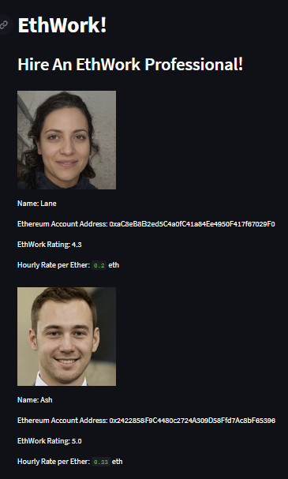
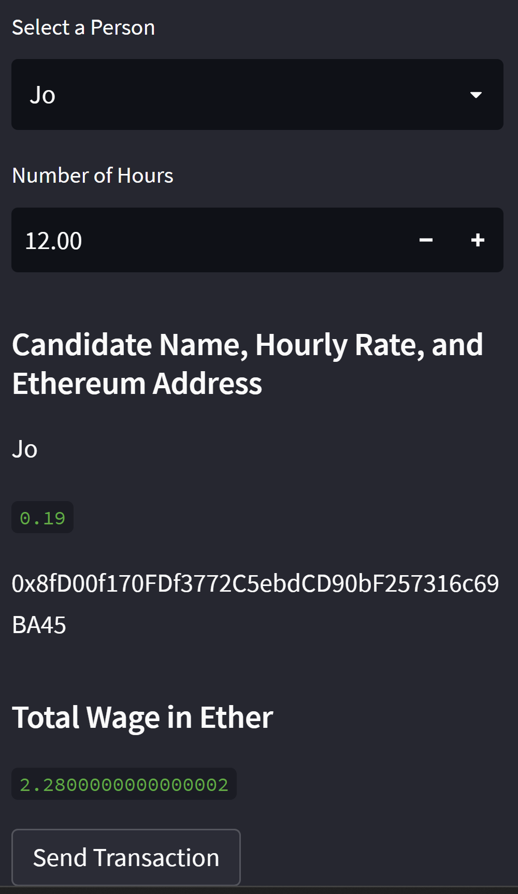
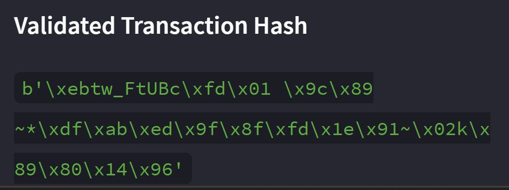

# EthWork_Integrated_Eth_Payments
This is an Ethereum application built using python, deployed using streamlit, and utilizing the ganache test network that allows users to find EthWork professionals and pay them in Ether. Once paid a Validated Transaction Hash is displayed that can be used to verify the success of payment.

## Browse your EthWork Professionals:


---

## Select Professional and Choose Number of Hours:


---

## Verification of Payment:


---

## Technologies

This analysis uses Python and the following libraries:
* [Pandas](https://pandas.pydata.org/) - Provides data manipulation and visualization.
* [dataclass](https://docs.python.org/3/library/dataclasses.html) - Provides a decorator and functions for automatically adding generated special methods.
* [Typing](https://docs.python.org/3/library/typing.html) - Provides runtime support for type hitns
* [datetime](https://docs.python.org/3/library/datetime.html) - Provides classes for manipulating dates and times
* [bip44](https://oipwg.github.io/oip-hdmw/Wallet.html) - For creating the wallet instance.
* [dotenv](https://github.com/motdotla/dotenv) - Load environment variables from .env file.
* [web3](https://github.com/ethereum/web3.py) - A python library for interacting with Ethereum.
* [requests](https://requests.readthedocs.io/en/latest/) - HTTP library for python.
* [os](https://docs.python.org/3/library/os.html) - Portable way of using operating system dependent functionality.
* [streamlit](https://docs.streamlit.io/) - Python library for creating and sharing custom web apps.

---

## Installation Guide

To run this app please follow these steps:

1. Download and install [Anaconda](https://www.anaconda.com/products/distribution). 

2. Clone the the EthWork_Integrated_Eth_Payments repository to your local machine.

3. Navigate to the directory of the cloned repo in your terminal/gitbash.

4. Run the following command in your terminal or gitbash:
```python
pip install -r requirements.txt
```
5. Install [Ganache](https://trufflesuite.com/ganache/)

6. Store your seed phrase as a string variable named MNEMONIC in a .env file in the EthWork_Integrated_Eth_Payments directory.

7. Run the following command in your terminal or gitbash:
```python
streamlit run ethWork.py
```

---

## Usage

After lauching the application on your computer you can select different proffesionals on EthWork and determine how many hours you wish to hire them for. Then you can send them payments in eth directly from the app and verify that the transactions went through.

---

## Contributors

Derick Decesare | [LinkedIn](https://www.linkedin.com/in/derickdecesare/) | derick.decesare@gmail.com

---